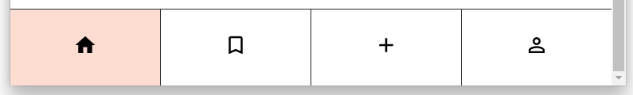
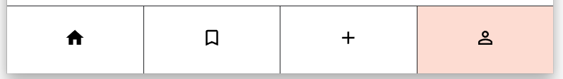

## Quiz App Ultra - Part 2

In this challenge your quiz app will become interactive. The user will be able to press the "Show answer" button and see the answer to the question. Also the navigation will ne clickable and indicate which site you are on.

### Part 2a - Show answer toggle

- Add a `showAnswer` state to your `Card` component.
- Make the answer only render when the `showAnswer` state is `true` (conditional rendering).
- Depending on the `showAnswer` state make the button say "Show answer" or "Hide answer".
- On a button click the `showAnswer` state should be toggled.

### Part 2b - Navigation bar

The navigation bar has four buttons that should enable the user to switch to another site. We will make the navigation clickable and indicate which site the user is on.

> ❗️ After this challenge the site will still not really change - the user will see the same cards after clicking on the navigation.

- Add a state to the `Navigation` component that indicates which page the user is on.
- Depending on the state highlight the corresponding element in the navigation.
- If the user clicks on another button in the navigation, the state should change to indicate that the user is on a different page now.

Examples:

Example 1: After the user has clicked on the "home" button

Example 2: After the user has clicked on the "profile" button
