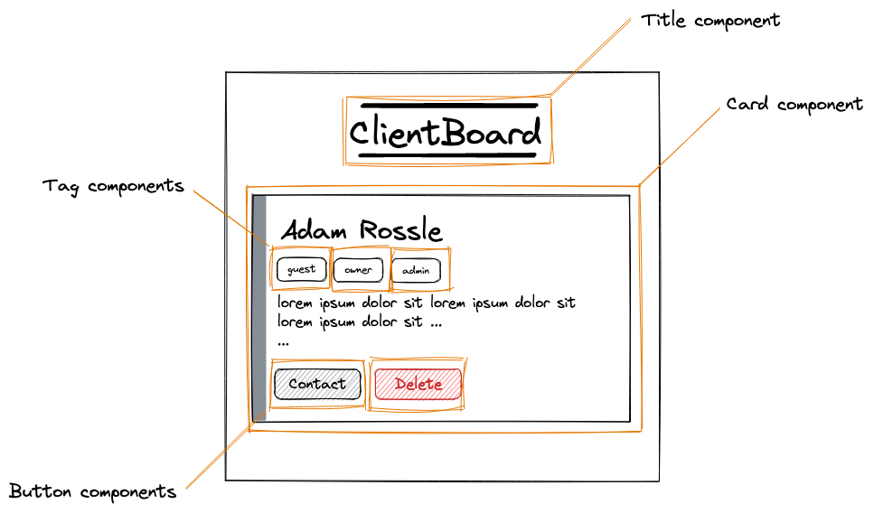

# Challenges: React Props

## Exercise 1

Solve this:
[start here](https://codesandbox.io/s/react-props-exercise-box-start-ekp84d)

1. Find the prepared component `Box` and give it some styling.
2. Call the `Box` multiple times inside `App`.
3. Pass a "boolean prop" called `highlight` to all Boxes.
4. Use the prop inside the component. When `highlight` is `true`, then give the component another `className` called `box--highlight` (you have to create the `box--highlight` class yourself).
5. Experiment with the Box component and change the value of its prop highlight.

## Exercise 2

[start here](https://codesandbox.io/s/react-props-exercise-start-n5t0e2)

Create the components as described in the Wireframe. Which props should they get? Decide for yourself!

(Hint: The card component will be created from a user object containing all the data about a single user.)
