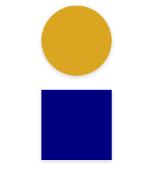

# Styled Components

## Exercise 1

[Start here](https://codesandbox.io/s/styled-components-exercise-figures-start-n56fjm?file=/src/App.js)

- Create 2 styled components called Circle and Square. They should look something like this:
  

- Add a hover effect to the square, such that its background color gets the value 'turquoise'. Add a transition to the element as well.

## Exercise 2

[In this codesandbox](https://codesandbox.io/s/styled-components-exercise-clientboard-start-cd1irt) you can find the starter code for the following exercises.

- 1.1: Convert the classes from the files `App.css` and `Card.css` into styled components. Use nested styling when necessary.
- 1.2: Instead of creating a whole component in our components folder, create a styled component for the `Title`. Use the styling from the 'Title.css' file. Delete the Title.js and Title.css files afterwards.

## Exercise 3

- 2.1: Create a styled component to replace the `Button` component.
- 2.2: If the array `user.roles` in the user object includes the role 'admin', the left border of a card should be 'hotpink'. Use conditional styling.

## Exercise 4

- 3.1: Create a `GlobalStyle.js` file and create a component called `Globalstyle` with the function createGlobalStyle. Then move the global styling from index.css into this component.
- 3.2: Set the background-color and box-sizing in the GlobalStyle component.
- 3.3: Import a custom font from [google fonts](https://fonts.google.com). Include it with a link tag in the html head of the project and use it inside the GlobalStyle.

## Exercise 5 (Extra)

- Recreate the `Tag` component as a styled component, including the conditional styling!
