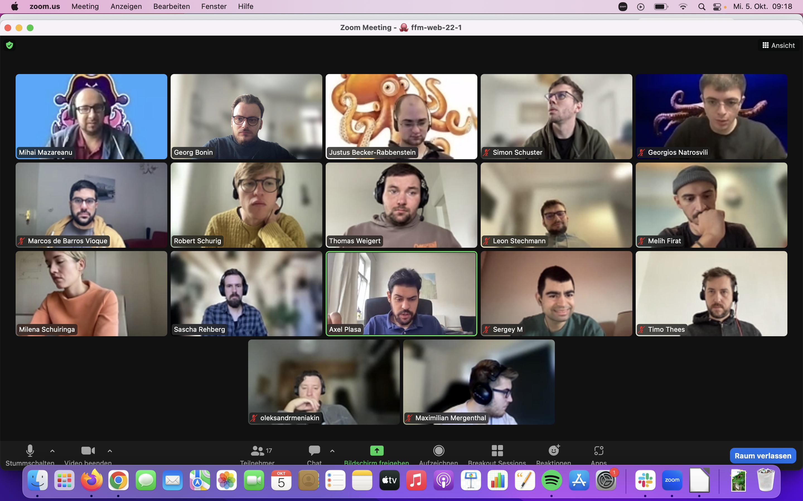

## Themen

- Shell Basics
- Git

---

## Notizen

### Shell

- [Shell Basics](../sessions/shell-basics/shell-basics.md)

### Git

- [Git CLI & remote](../sessions/git-cli-and-remote/git-cli-and-remote.md)
- [Assets](../sessions/git-cli-and-remote/assets/)

---

## Material & Links

- [Terminal (Mac) - Cheatsheet](https://github.com/0nn0/terminal-mac-cheatsheet#english-version)
- [Git (Mac) - Cheatsheet](https://training.github.com/downloads/github-git-cheat-sheet/)

## Aufgaben

- [Shell Challenges](../sessions/shell-basics/challenges-shell-basics.md)
- [Git Challenges](../sessions/git-cli-and-remote/challenges-git-cli-and-remote.md)

---

## Anwesenheit

