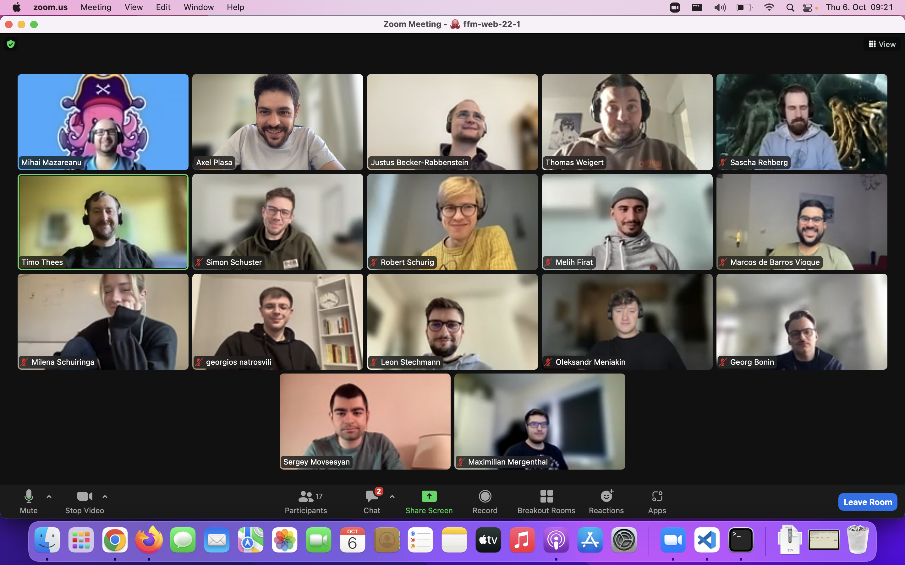

## Themen

- Shell Basics recap
- Git basics
- Html basics
- Breather mit Philip Messerschmidt

---

## Notizen

### HTML & web

- [HTML and web](../sessions/html-and-the-web/html-and-the-web.md)

### Git branches

- [Git CLI & remote](../sessions/git-cli-and-remote/git-cli-and-remote.md)
- [Assets](..sessions/git-branches-and-prs/git-branches-and-prs.md/)

---

## Material & Links

## Aufgaben

- [Html Challenges](../sessions/html-and-the-web/challenges-html-and-the-web.md)
- [Git Branches Challenges](../sessions/git-branches-and-prs/challenges-git-branches-and-prs.md)

---

## Anwesenheit

