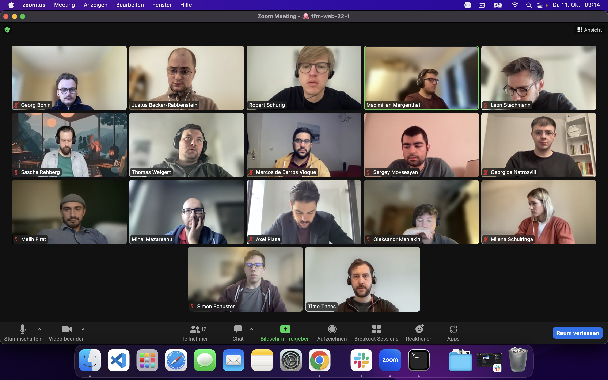

## Themen

- Morning: CSS-Flexbox & breather with Jennifer
- Afternoon: CSS Positioning (position: absolute, relativ, ...) & z-index

---

## Notizen

### CSS-Flexbox

- CSS-Flexbox with display: flex / align-items: ... / justify-content: ... / gap: ... / flex-direction: ... / flex-wrap: ...

### CSS Positioning

- CSS Positioning with: position: relative | absolute | sticky | fixed / top: ... / bottom: ... / right: ... / left: ...

---

## Material & Links

### CSS-Flexbox

- [css-flexbox](../sessions/css-flexbox/css-flexbox.md)

### CSS Positioning

- [css-positioning](../sessions/css-positioning/README.md)

---

## Aufgaben

- [css-flexbox-aufgaben](../sessions/css-flexbox/challenges-css-flexbox.md)
- [css-positioning-afugaben](../sessions/css-positioning/challenges.md)

---

## Open Questions

- Why does axe Linter for Visual Studio Code crash with:
  [Error - 5:02:12 PM] Starting client failed
  Error: spawn Unknown system error -86
  at ChildProcess.spawn (node:internal/child_process:413:11)
  at Object.spawn (node:child_process:720:9)
  at /Users/justusbecker-rabbenstein/.vscode/extensions/deque-systems.vscode-axe-linter-4.4.2/dist/src/extension.js:2:248625
  [axe-linter-vss-extension-error-thread](https://github.com/dequelabs/axe-core/issues/3475)

## Anwesenheit

