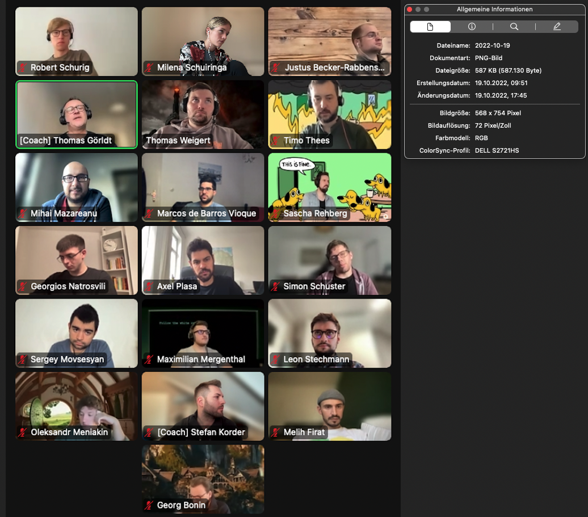

## Themen

- Quiz-App
- html Forms
- JS Forms

---

## Notiz
- JS Forms Lösungen der 2. Challenge:
(https://codesandbox.io/s/gallant-wood-jvhlsh?file=/js/index.js)
- JS Forms Lösungen der 3. Challenge:
(https://codesandbox.io/s/practical-noether-ns4jhh?file=/js/index.js)
    
### html Forms

### JS Forms
- (https://codesandbox.io/s/ffm-web-22-1-js-forms-tln7gj?file=/js/index.js)

---

## Material & Links

- [html-forms](../sessions/html-forms/html-forms.md)
- [js-forms](../sessions/js-forms/js-forms.md)

---

## Aufgaben

- [html-forms](../sessions/html-forms/challenges-html-forms.md)
- [js-forms](../sessions/js-forms/challenges-js-forms.md)

---

## Offene Fragen

- ***

## Anwesenheit

