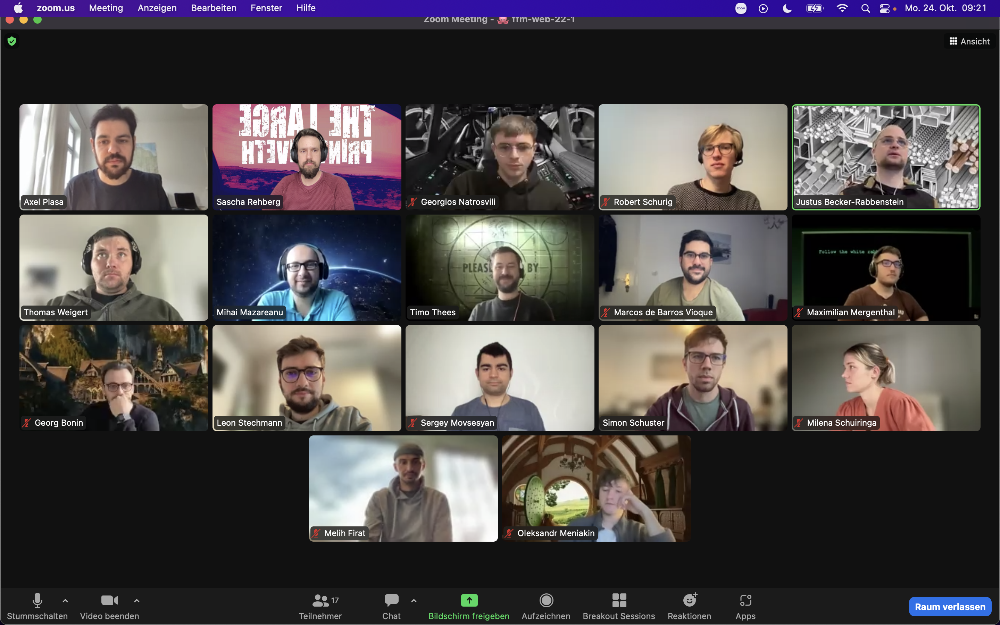

## Themen

### Vormittag

- Besprechung **Quiz-App** Wochenendfortschritt
- Git Advanced
- Debugging

### Nachmittag

- Kurze Übung zu Git Advanced und Versuch der Fehlerrekonstruktion
- JS Objects and Arrays

---

## Notizen

### Quiz-App

- So ziemlich alle Gruppen sind übers Wochende auf verschiedene Probleme mit Github gestoßen. Deshalb wurde auch die Git Advanced Session kurzfristig vorverlegt.

### Git Advanced

- Besprechung des Git-Workflows mit besonderem Fokus auf Problemlösung bei Merge-Konflikten. Dabe empfiehlt es sich, den Konflikt lokal statt in Github zu lösen. Lokal muss man dann etwas unintuitiv den Main-Branch in den Konflikt-branch mergen. Dadurch werden die konfliktauslösenden Zeilen jeweils untereinander angezeigt und man kann (muss) sich für eine Variante entscheiden, damit umzugehen. Anschließend wird noch mal gepushed. Das Pull Request sollte nun, so man alles richtig gemacht hat, problemlos zu mergen sein.

## Debugging

- Gastsession mit Fokus auf die richtige Herangehensweise bei Fehlermeldungen im Code. Dabei mehrfach der starke Hinweis, dass man fehlerhaften Code bald beheben sollte, da man sonst nicht sicher sein kann, dass weitere Arbeit korrekt funktioniert.

## JS Objects and Arrays

- Arrays können verschiedene Datentypen aufnehmen. Die müssen wiederum nicht vom selben Typ sein. Arrays werden mit eckigen Klammern initialisiert. Einer der möglichen Datentypen im inneren eines Arrays ist ein weiteres Array.
- Objects sind Container, in denen logisch zusammenhängende Inhalte gebündelt werden können. Über den Namen des Obejects kann man dann vergleichsweise simpel auf diese Inhalte zugreifen.
- Arrays können Objects enthalten.
- Objects können Arrays enthalten.
- Objects können Objects enthalten.

## Material & Links

- [Git Advanced](https://github.com/neuefische/ffm-web-22-1/blob/main/sessions/git-advanced/git-advanced.md)

- [JS Objects and Arrays](https://github.com/neuefische/ffm-web-22-1/blob/main/sessions/js-objects-and-arrays/js-objects-and-arrays.md)

- Session von Stefan zu JS Objects and Arrays
  https://codesandbox.io/s/ffm-web-22-1-objects-and-arrays-cdjijc?file=/src/index.js

---

## Aufgaben

- [Git Advanced](https://github.com/neuefische/ffm-web-22-1/blob/main/sessions/git-advanced/challenges.git.advanced.md)
- [JS Objects and Arrays](https://github.com/neuefische/ffm-web-22-1/blob/main/sessions/js-objects-and-arrays/challenges-js-objects-and-arrays.md)

---

## Offene Fragen

- ***

## Anwesenheit

