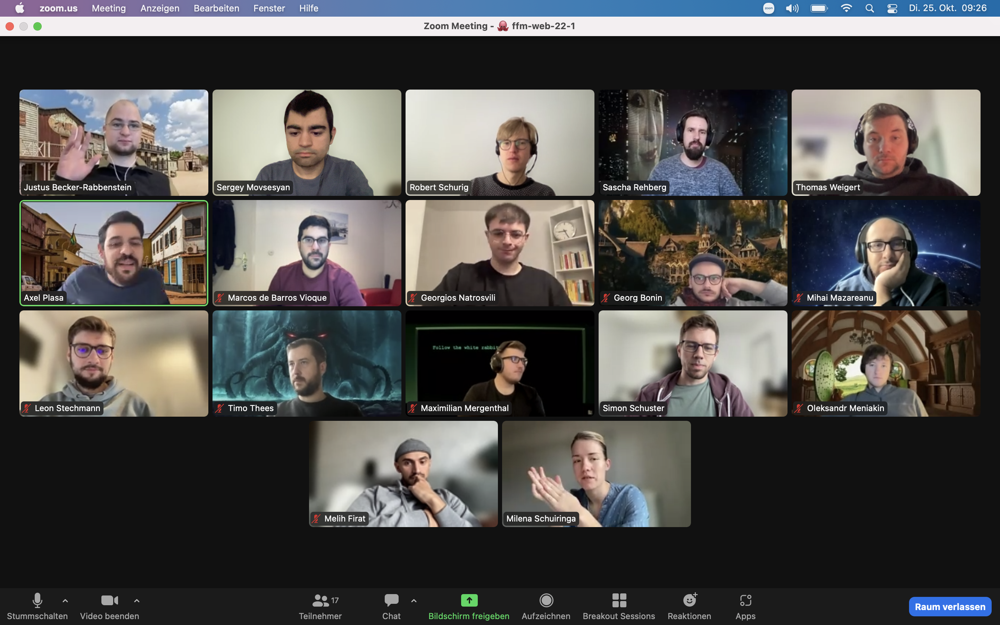

## Themen

### Vormittag

- Array Methods

### Nachmittag

- NPM and Linting Basics

---

## Notizen

### Array-Methods

- Gelernt wie man durch .foreach(),.map(),filter() Methoden die Objecte aufruft und in Funktionen integriert.

### NPM and Linting Basics

- Mit NPM Packgages und Linters ("Prettier", "HTMLhint", "ESLint") gelernt die Fehlern in HTML und JS Dateien zu erkennen und fixen.

---

## Material & Links

- [JS Array Methods](https://github.com/neuefische/ffm-web-22-1/blob/main/sessions/js-array-methods/js-array-methods.md)

- [NPM and Linting Basics](https://github.com/neuefische/ffm-web-22-1/blob/main/sessions/npm-and-linting-basics/npm-and-linting-basics.md)

---

## Aufgaben

- [JS Array Methods](https://github.com/neuefische/ffm-web-22-1/blob/main/sessions/js-array-methods/challenges-js-array-methods.md)
- [NPM and Linting Basics](https://github.com/neuefische/ffm-web-22-1/blob/main/sessions/npm-and-linting-basics/challenges-npm-and-linting-basics.md)

---

## Anwesenheit

