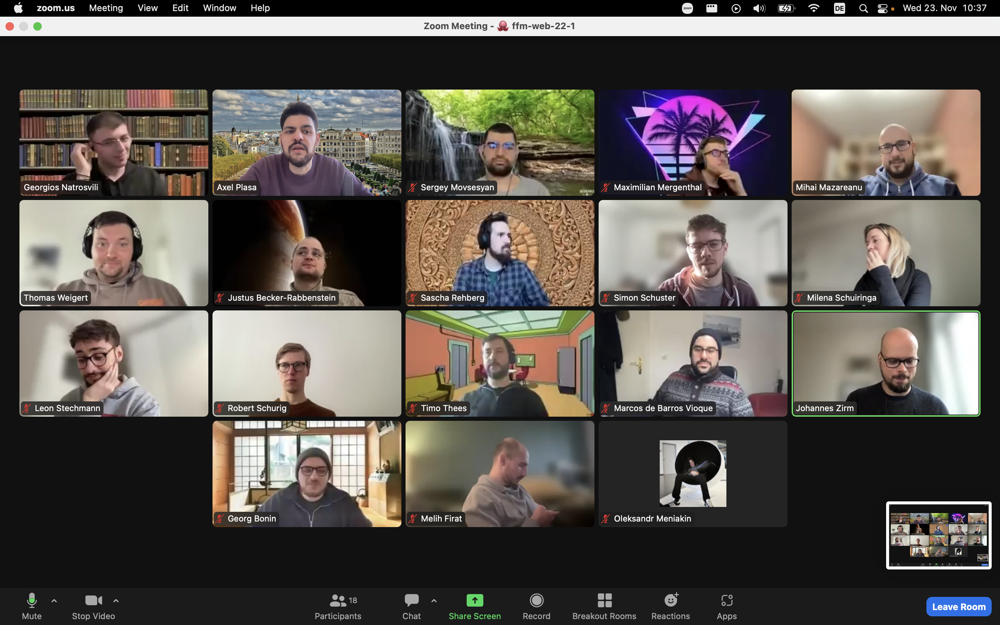

### Themen & Notizen

## Agile: Kanban & Scrum

Session mit Johannes Zirm:

Mit Kanban und Scrum kann agiles Arbeiten bewerkstelligt werden. So können Prozesse horizontal und simultan nach dem Pull-Prinzip anstatt des Push-Prinzip bewältigt werden, und die Entscheiungspyramide kann radical verändert werden.

Evtl. gibt es morgen noch nachträgliche Session über Userstories.

## Start der Capstone-Projekte:

Erste Sitzung der Capstone Projekte und One-on-One Interviews mit den Alumni über die persönlichen Pläne und Ideen.

## Material & Links

- https://www.scrum.org/

## Aufgaben

Scrum - Kurzer praktischer Ausflug in Scrum-Zyklus.

- ***

## Anwesenheit

